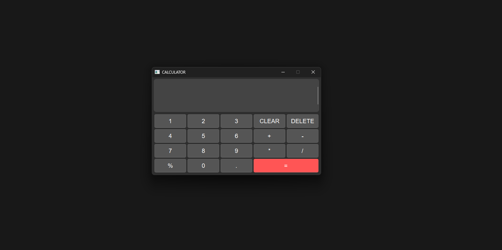
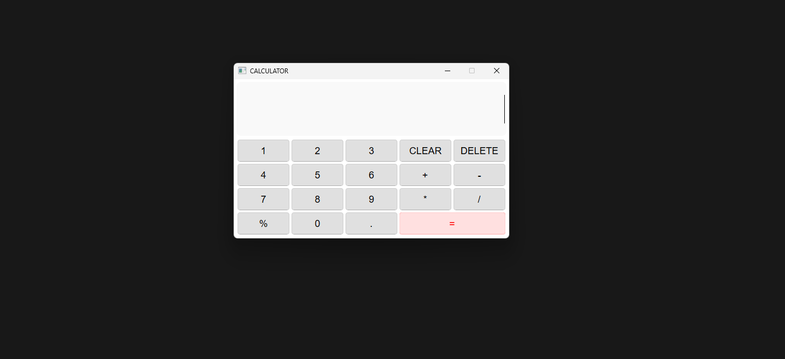

# CALCULATOR APP.
 A basic calculator application built using Python 3.13.1 and Pyside6.

## How to use.
Extract the executable from the zip in the [dist](./dist/) folder.
The calculator works both in light and dark mode.
## Dark mode.

## Light mode.

